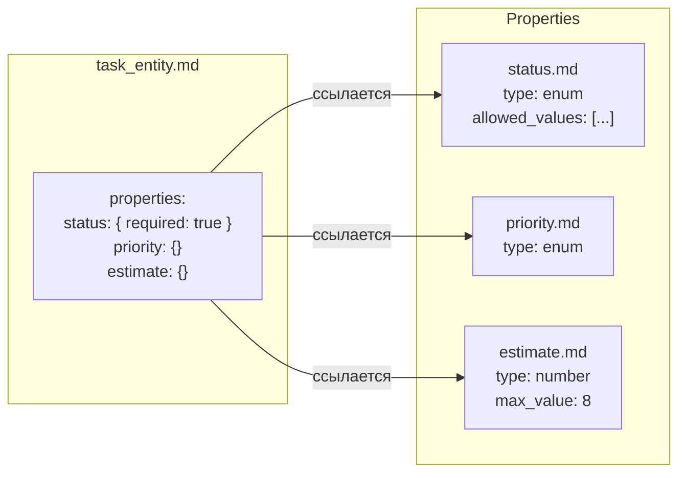
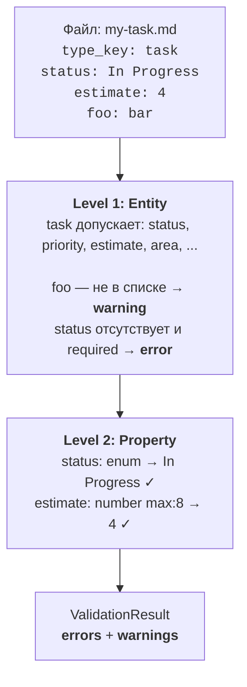
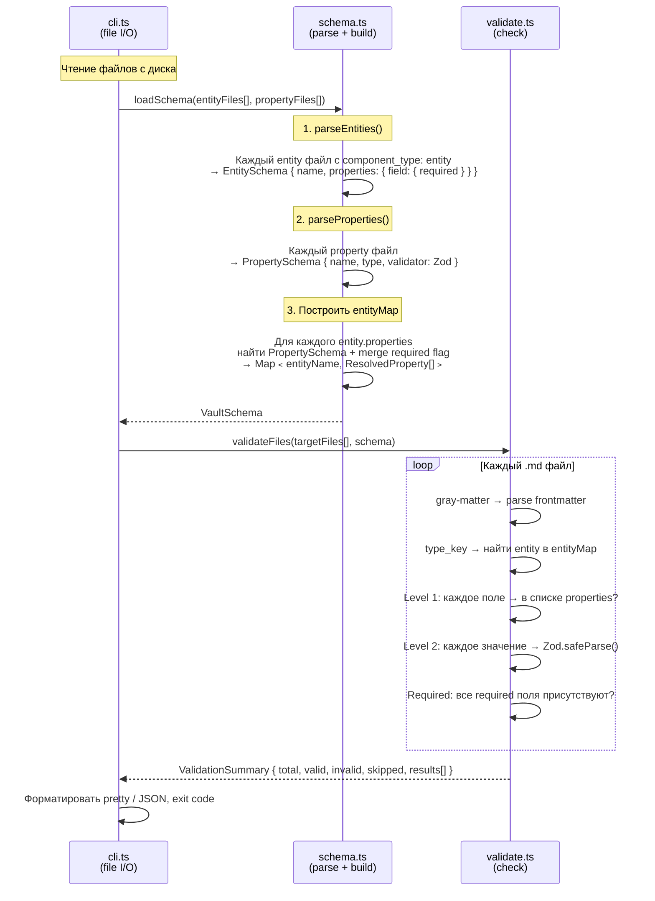

# Architecture

## Принцип

Vault = schema + data. Schema описана в самом vault через entity и property файлы. Валидатор ничего не придумывает — все правила из YAML frontmatter.

**Entity** = структура (какие поля, required/optional)
**Property** = валидация (тип, ограничения)

Зависимость однонаправленная: entity → property. Property ничего не знает о entities.

## Entity-centric подход



Entity файл объявляет свои поля и required флаги. Property файл описывает как валидировать значение. Одно property может использоваться несколькими entities (например `status` — в task, book, area), но property об этом не знает.

## Двухуровневая валидация



**Warning** = поле не в schema (не блокирует). **Error** = значение невалидно или required отсутствует (блокирует).

## Поток данных



## Модули

```
src/
  types.ts      — RawFile, PropertySchema, EntitySchema, VaultSchema,
                   ResolvedProperty, ValidationResult, ValidationSummary
  schema.ts     — parseProperties(), parseEntities(), loadSchema()
                   + buildPropertyValidator() → Zod
  validate.ts   — validateFile(), validateFiles()
  cli.ts        — readMdFiles(), formatPretty(), commander CLI
```

| Модуль | Что делает | File I/O | Runtime-agnostic |
|--------|-----------|:--------:|:---:|
| `types.ts` | Типы данных | нет | да |
| `schema.ts` | Парсинг schema файлов → entityMap + Zod validators | нет | да |
| `validate.ts` | Двухуровневая валидация frontmatter | нет | да |
| `cli.ts` | Чтение файлов, CLI, форматирование вывода | **да** | нет |

Core (`types`, `schema`, `validate`) принимают `RawFile[] = { path, content }[]`. Кто прочитал файлы — неважно. CLI делает это через `fs`, Obsidian plugin сделает через Vault API.

## property_type → Zod

Каждый property файл содержит `property_type` в frontmatter. `buildPropertyValidator()` компилирует его в Zod schema:

| property_type | Zod | Почему так |
|---------------|-----|-----------|
| `string` | `z.string()` | — |
| `number` | `z.number().min().max()` | min/max из frontmatter |
| `boolean` | `z.boolean()` | — |
| `date` | `z.union([z.string(), z.date()])` | gray-matter может отдать JS Date |
| `time` | `z.string()` | — |
| `enum` | `z.preprocess(coerce, z.enum([...]))` | YAML числа → строки |
| `link` | `z.union([z.string(), z.array(z.string())])` | YAML single vs array |
| `list` | `z.array(z.unknown())` | — |

## Ключевые типы

```typescript
// Что entity знает о своих полях
EntitySchema = {
  name: "task"
  properties: {
    status: { required: true }
    priority: {}
    estimate: {}
  }
}

// Как валидировать конкретное поле
PropertySchema = {
  name: "status"
  property_type: "enum"
  allowed_values: ["Backlog", "Planned", ...]
  validator: ZodSchema  // скомпилированный
}

// Результат merge: property schema + required flag от entity
ResolvedProperty = PropertySchema & { required: boolean }

// entityMap: "task" → [
//   { name: "status", type: "enum", required: true, validator: z.enum([...]) },
//   { name: "priority", type: "enum", required: false, validator: z.enum([...]) },
//   { name: "estimate", type: "number", required: false, validator: z.number().max(8) },
// ]
```

## Vault schema файлы

### Entity (`vault/entities/**/*_entity.md`)

```yaml
---
type_key: system_component
component_type: entity          # ← фильтр: только entity
properties:                     # ← какие поля допустимы
  status: { required: true }    # ← required
  priority: {}                  # ← optional (default)
  estimate: {}
  area: {}
---
# Entity: Task
(документация, dataview запросы, примеры — не парсятся)
```

Имя entity берётся из frontmatter `name:` или из filename: `task_entity.md` → `task`.

### Property (`vault/properties/*.md`)

```yaml
---
type_key: property
name: status                    # ← имя property
property_type: enum             # ← тип валидации
allowed_values:                 # ← ограничения
  - Backlog
  - In Progress
  - Done
---
# status
(документация — не парсится)
```

Property **не знает** какие entities его используют — нет `used_by`. Связь идёт от entity к property через `properties:` блок.
