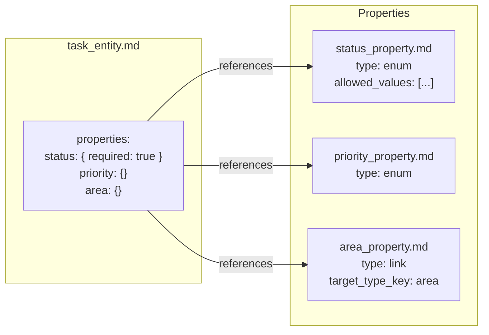
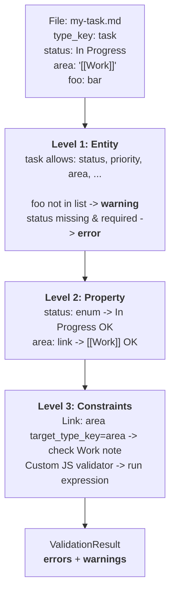
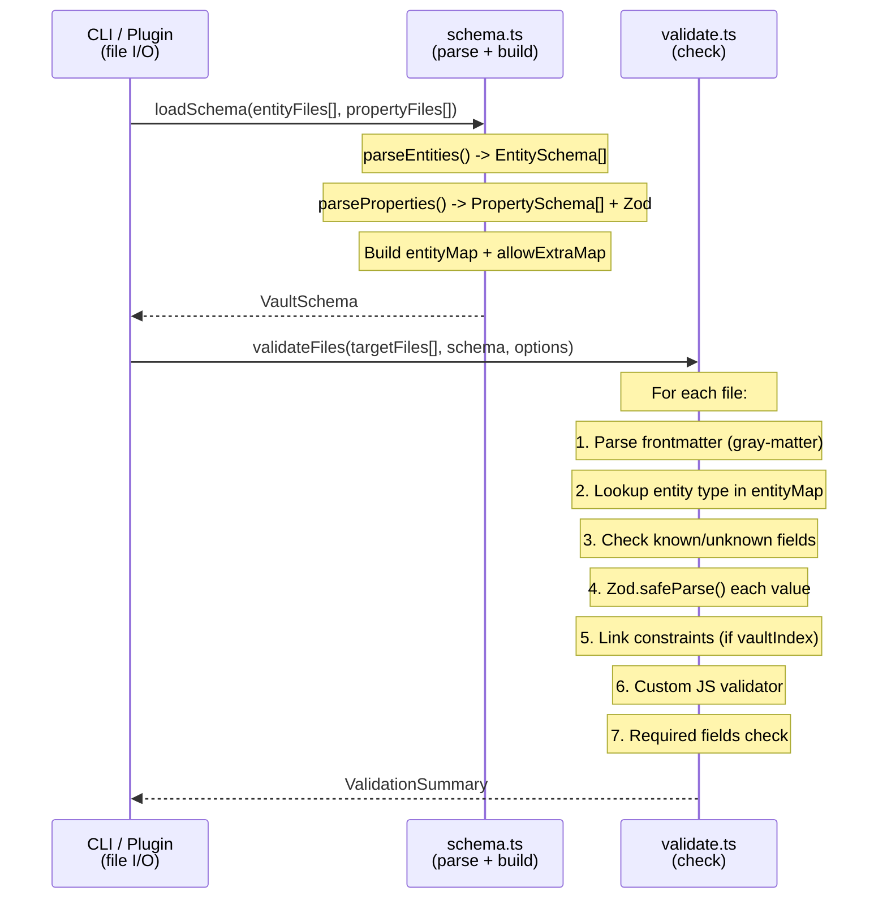
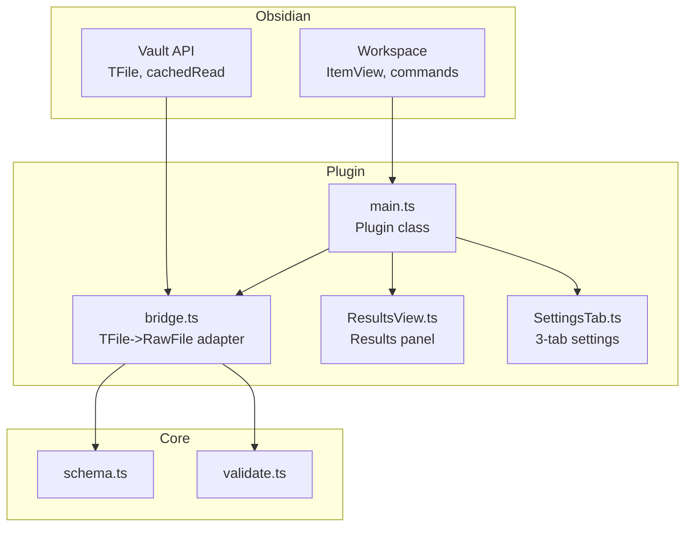

# Architecture

## Core Principle

Vault = schema + data. Schema is defined in the vault itself via entity and property files. The validator invents nothing — all rules come from YAML frontmatter.

**Entity** = structure (which fields, required/optional, allow_extra)
**Property** = validation (type, constraints, link targets, custom JS)

Dependency is one-way: entity -> property. Properties know nothing about entities.

## Module Structure

```
src/
  # Core library (runtime-agnostic, no file I/O)
  types.ts                    # All types: RawFile, VaultSchema, ValidateOptions, etc.
  schema.ts                   # Parse entity/property files -> entityMap + Zod + inheritance
  validate.ts                 # Three-level validation + link constraints + custom JS
  index.ts                    # Library entry point (re-exports)
  cli.ts                      # CLI entry point (only module with fs access)
  config.ts                   # CLI config resolution

  # Obsidian plugin
  plugin-main.ts              # Plugin class: commands, ribbon, status bar, events
  bridge.ts                   # TFile <-> RawFile adapter, vault index, file writes
  constants.ts                # Settings interface, defaults
  SettingsTab.ts              # Tabbed settings UI (Settings, Entities, Properties)
  ResultsView.ts              # Validation results panel (ItemView)
  ui/
    TabManager.ts             # Generic tab navigation component
    EntitiesTab.ts            # Entity CRUD UI with inheritance
    PropertiesTab.ts          # Property CRUD UI with link constraints
    yamlWriter.ts             # YAML frontmatter serializer
    empty-fs.ts               # fs shim for gray-matter in browser

# Root (official Obsidian plugin layout)
manifest.json                 # Plugin manifest
styles.css                    # Plugin styles
esbuild.config.mjs            # Build config
```

## Two Consumers, One Core

```
                    ┌─────────────────┐
                    │   Core Library   │
                    │ schema.ts        │
                    │ validate.ts      │
                    │ types.ts         │
                    └────────┬────────┘
                             │
              ┌──────────────┼──────────────┐
              │              │              │
     ┌────────▼──────┐  ┌───▼──────┐  ┌───▼──────────┐
     │   CLI          │  │ Plugin   │  │ Future       │
     │ cli.ts         │  │ bridge.ts│  │ integrations │
     │ fs.readFile()  │  │ cachedRead│  │              │
     └───────────────┘  └──────────┘  └──────────────┘
```

Core accepts `RawFile[] = { path: string, content: string }[]` — who reads the files is irrelevant. CLI uses `fs`, plugin uses Obsidian Vault API.

## Entity Inheritance

Entities support single inheritance via `extends`. The schema loader resolves the full chain and merges properties (parent first, child overrides). Circular dependencies are detected at load time.

```
base → trackable → structure → task
                              → epic
                              → area
       trackable → rhythm    → day
                              → sprint
       trackable → cmdb      → book
                              → service
```

Each entity file stores only its **own** properties. The `entityMap` contains the fully resolved set.

## Entity-Centric Schema



## Three-Level Validation



**Warning** = field not in schema (non-blocking). **Error** = invalid value, missing required, or failed constraint (blocking).

## Data Flow



## Plugin Architecture



## property_type -> Zod Mapping

| property_type | Zod | Notes |
|---------------|-----|-------|
| `string` | `z.string()` | |
| `number` | `z.number().min().max()` | min/max from frontmatter |
| `boolean` | `z.boolean()` | |
| `date` | `z.union([z.string(), z.date()])` | gray-matter may return JS Date |
| `time` | `z.string()` | |
| `datetime` | `z.union([z.string(), z.date()])` | |
| `enum` | `z.preprocess(coerce, z.enum([...]))` | numbers coerced to strings |
| `link` | `z.union([z.string(), z.array()])` | + optional link constraints |
| `wikilink` | `z.union([z.string(), z.array()])` | alias for link |
| `list` | `z.array(z.unknown())` | + optional link constraints |
| `emoji` | `z.string()` | |
