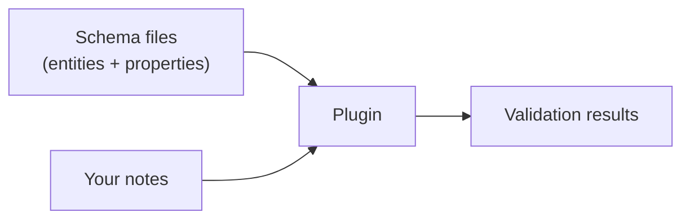
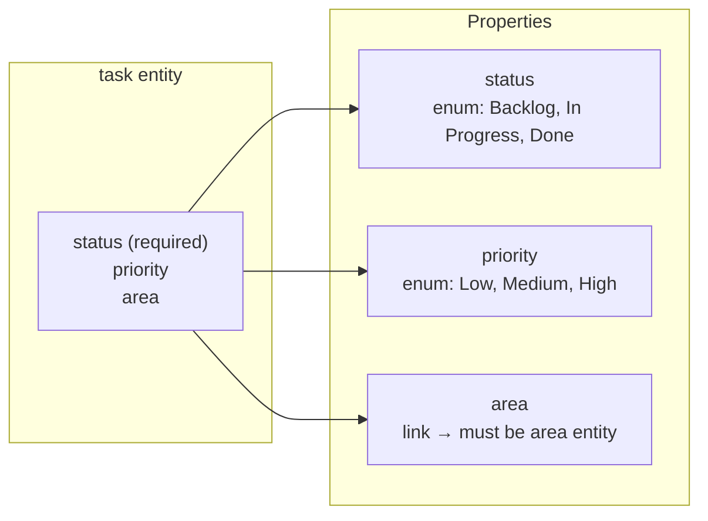
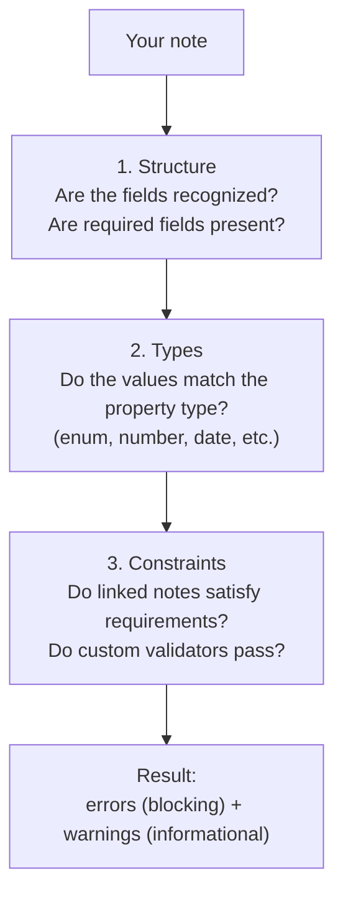
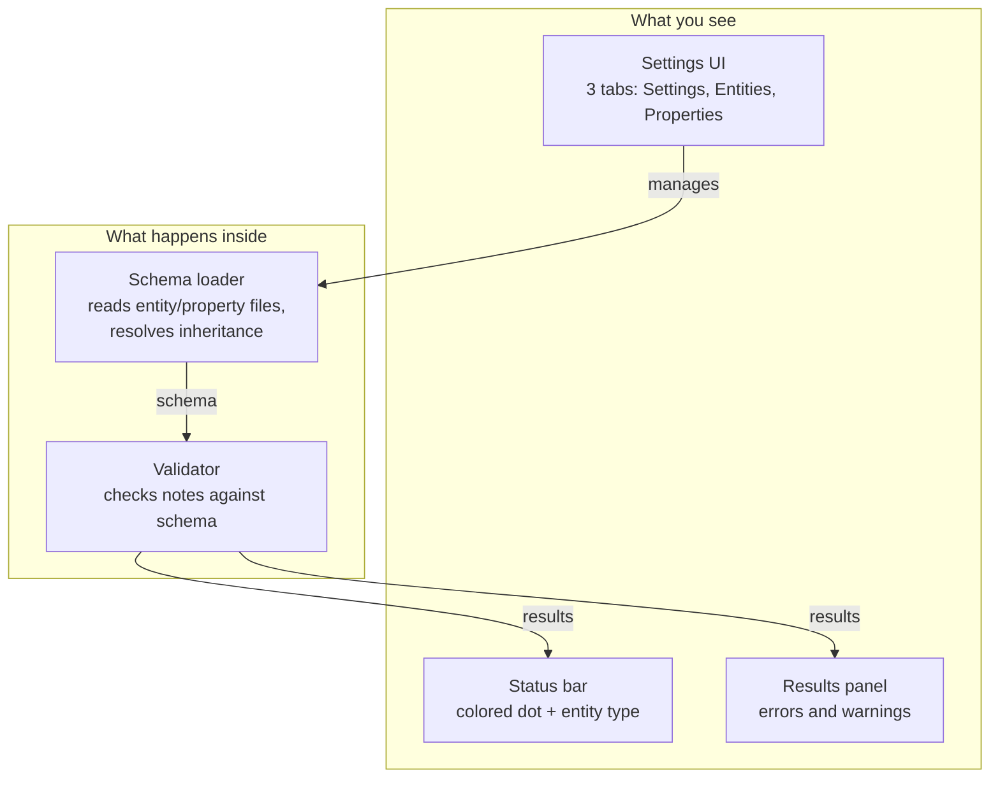
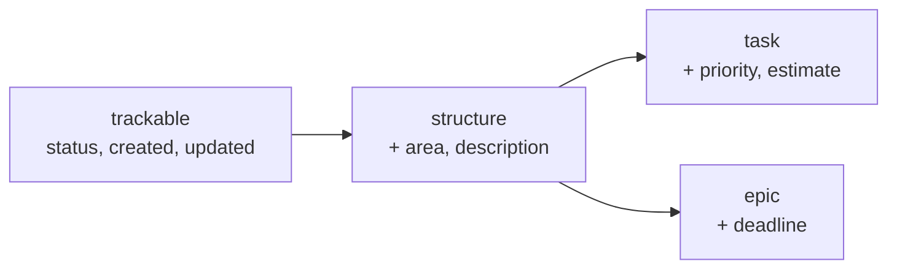

# Architecture

> For user-facing docs, see [Getting started](getting-started.md).

## Core idea

Your vault contains two things: **schema** (how notes should look) and **data** (the notes themselves). The plugin reads the schema, then checks every note against it.

---

## Entities and properties

**Entities** define structure — which fields a note type has.
**Properties** define rules — how to validate each field's value.

Entities reference properties, but properties don't know about entities. This means one property (e.g. `status`) can be reused across many entity types.

---

## How validation works

When you open or save a note, the plugin runs three checks in order:

---

## Plugin components

- **Schema loader** — reads your entity and property files, resolves inheritance chains, builds validation rules
- **Validator** — checks each note's frontmatter against the schema
- **Results panel** — shows errors and warnings, with clickable links to fields and notes
- **Settings UI** — create, edit, and archive entities and properties without touching files

---

## Reactive behavior

The plugin stays in sync automatically:

1. You edit a note — plugin revalidates it (debounced 800ms)
2. You switch files — plugin validates the new file
3. You change a schema file — plugin reloads the schema and revalidates
4. You edit via Settings UI — schema file updates, cache refreshes

---

## Entity inheritance

Entities can extend other entities. The plugin resolves the full chain at load time:

`task` gets all 7 properties: own + inherited. Child properties override parent's config. Circular inheritance is detected and reported as an error.

---

## Security

!!! warning
    Custom validators execute JavaScript in the same trust context as your vault. Only use validators from sources you trust.

The plugin operates within your own vault. Schema files are authored by the vault owner and stored as regular markdown.

**Custom validators** (`custom_validator` field) run JS expressions at validation time. The expression receives only the field `value` and has no access to other files or APIs. See [Schema reference > Custom validators](schema-reference.md#custom-validators) for usage.

**File operations**: the plugin reads files via Obsidian's Vault API and writes only to `{schema_dir}/entities/` and `{schema_dir}/properties/`. Archive moves files to `_deprecated/` (no deletion).

---

## Dependencies

| Package | Purpose |
|---------|---------|
| `gray-matter` | YAML frontmatter parsing |
| `zod` | Value validation |
| `commander` | CLI argument parsing (not bundled in plugin) |
| `obsidian` | Plugin API (provided by Obsidian) |
| `esbuild` | Build tool (dev only) |
