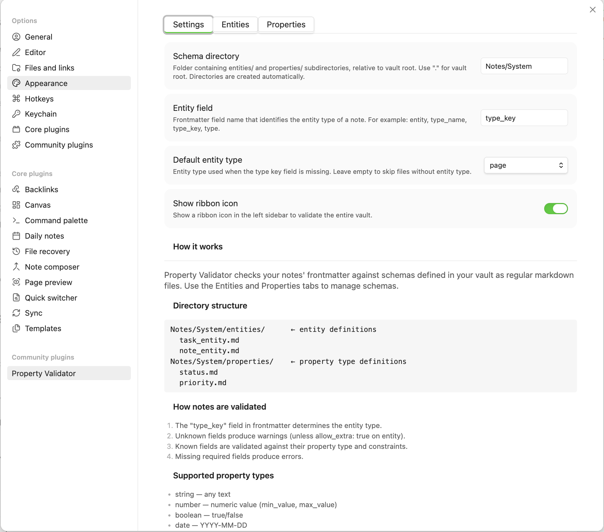
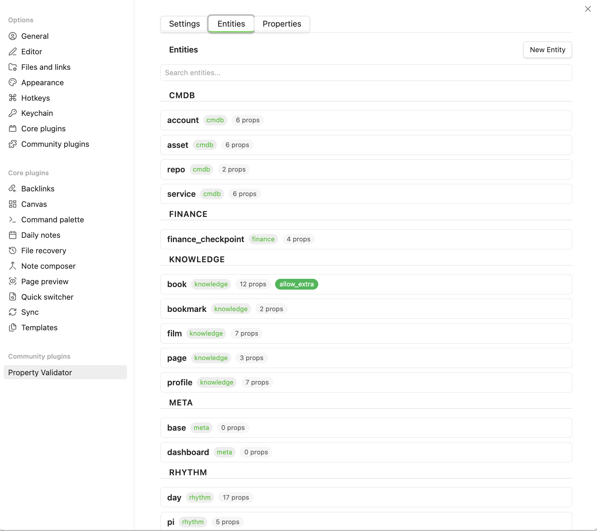
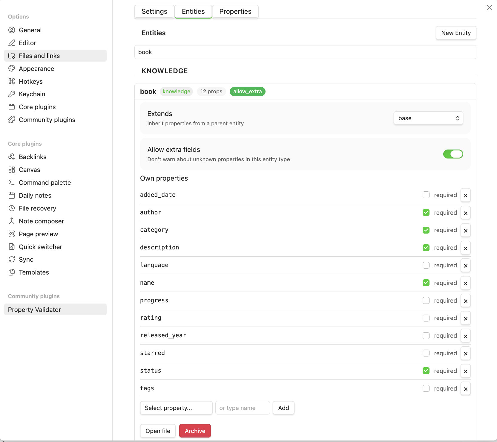
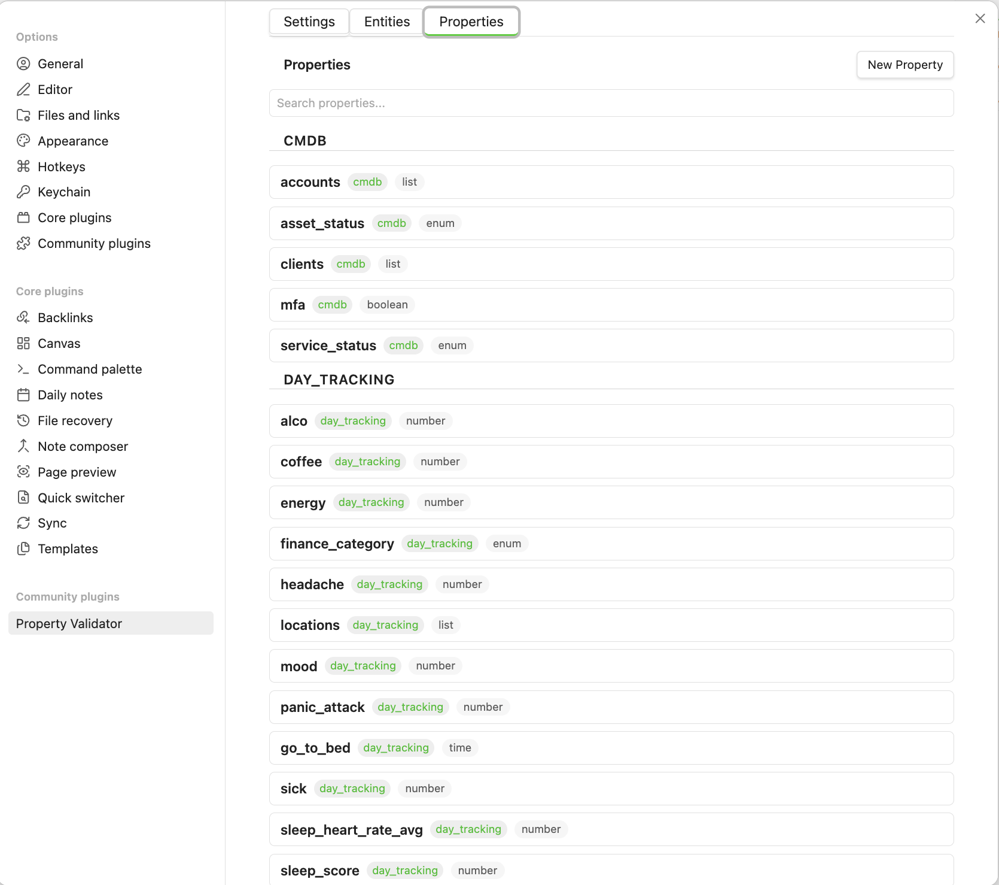
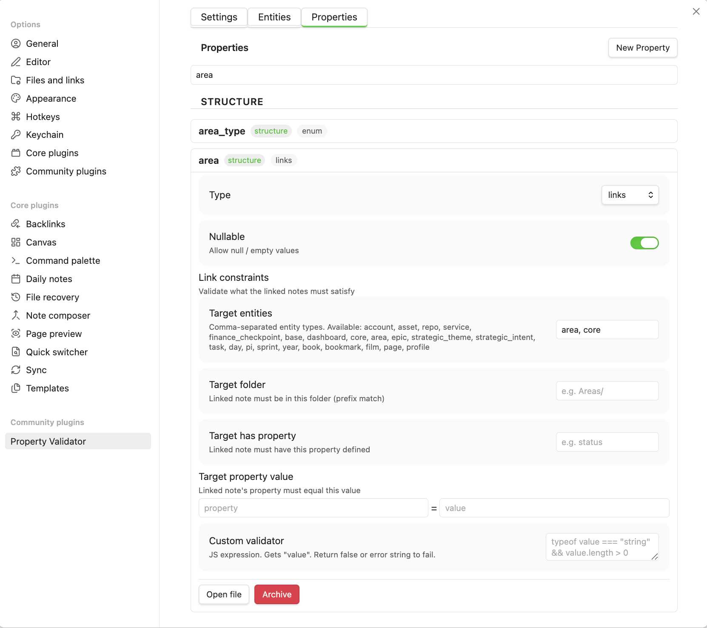

# Configuration

All settings are in **Settings > Property Validator**. Three tabs: Settings, Entities, Properties.

---

## Settings

| Setting | Default | Description |
|---------|---------|-------------|
| **Schema directory** | `.` | Folder with `entities/` and `properties/` subdirs, relative to vault root |
| **Entity field** | `entity` | Frontmatter field that identifies a note's entity type |
| **Default entity type** | *(empty)* | Fallback entity type when the field is missing. Empty = skip |
| **Show ribbon icon** | off | "Validate vault" button in the left sidebar |

!!! tip
    Set **Schema directory** to a dedicated folder like `System` to keep schema files separate from your notes.

---

## Commands

| Command | Description |
|---------|-------------|
| **Validate current file** | Validate the active note |
| **Validate vault** | Scan all markdown files |
| **Show validation results** | Open the results panel |

All available via Command Palette (`Cmd/Ctrl + P`).

---

## Status bar

Shows the current note's validation state with a colored dot:

- :green_circle: **Green** — valid
- :yellow_circle: **Yellow** — warnings only
- :red_circle: **Red** — has errors

Click to open the results panel. Hidden when the active file has no entity type.

---

## Reactive behavior

The plugin validates automatically:

- On file save (debounced 800ms)
- When switching files
- Schema cache refreshes when entity/property files change

---

## Managing schemas

!!! tip
    Schema files are regular markdown with YAML frontmatter. The UI and hand-editing are fully interchangeable — edit however you prefer.

### Entities tab

Lists all entities grouped by subdirectory. Click to expand:

- **Extends** — parent entity dropdown
- **Allow extra** — toggle for unknown fields
- **Own properties** — editable, with required toggles
- **Inherited properties** — read-only, grouped by source entity
- **Open file** / **Archive** buttons

#### Creating an entity

Click **Create new entity**. Enter name, parent, and properties.

See [Schema reference > Entity files](schema-reference.md#entity-files) for the full format.

#### Editing

Changes auto-save (500ms debounce). To override an inherited property, add it to the child's own list.

---

### Properties tab

Lists all properties grouped by subdirectory. Click to expand:

- **Type** and type-specific constraints
- **Nullable** toggle
- **Custom validator** expression
- **Open file** / **Archive** buttons

#### Creating a property

Click **Create new property**. Fields depend on type:

| Type | Additional fields |
|------|-------------------|
| `enum` | Allowed values list |
| `number` | Min, Max, Unit |
| `link`, `links`, `list` | Target type, folder, property, value |

See [Schema reference > Property files](schema-reference.md#property-files) for the full format.

#### Link constraints editor

For link/links/list types:

- **Target entity type** — comma-separated (e.g. `area, project`)
- **Target folder** — prefix match (e.g. `Areas/`)
- **Target has property** — field must exist
- **Target property value** — field must equal value

---

### Search

Both tabs have a search field at the top to filter by name.

### Archiving

Click **Archive** on any entity or property to move it to `_deprecated/`. Archived files are not loaded by the plugin. No data is deleted.
