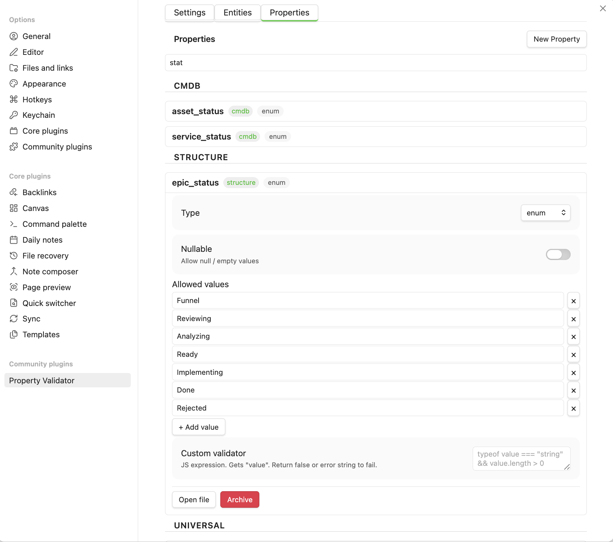
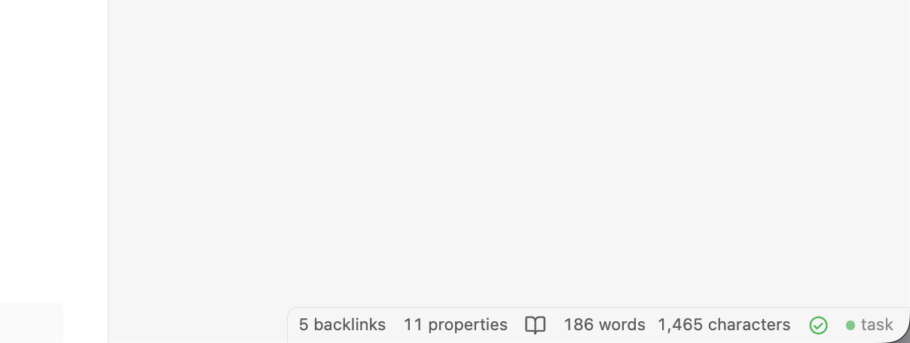
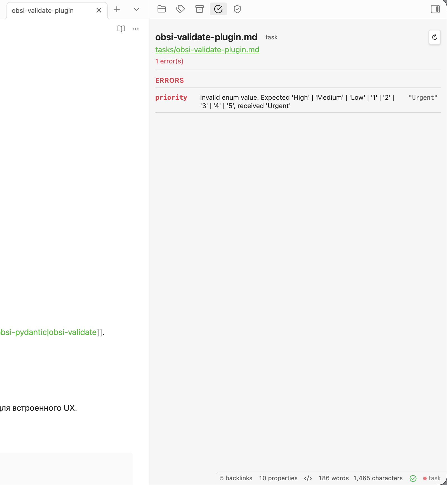
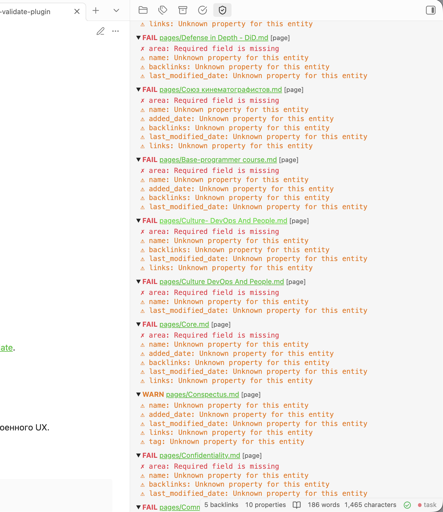

# Getting started

## Installation

1. Build the plugin:

    ```bash
    npm install && npm run build
    ```

2. Copy to your vault:

    ```bash
    mkdir -p /path/to/vault/.obsidian/plugins/property-validator
    cp main.js manifest.json styles.css \
       /path/to/vault/.obsidian/plugins/property-validator/
    ```

3. Enable in Obsidian: **Settings > Community plugins > Property Validator**

---

## Quick start

Create a schema and validate a note in 5 minutes.

### 1. Set the schema directory

Go to **Settings > Property Validator > Settings** and set the **Schema directory** (e.g. `System`). The plugin creates `entities/` and `properties/` subdirectories automatically.


---

### 2. Create an entity

!!! info "What is an entity?"
    An entity is a **note type** — like `task`, `book`, or `person`. It declares which frontmatter fields the note should have.

Open **Settings > Property Validator > Entities** tab and click **Create new entity**.

- **Name**: `task`
- **Properties**: add `status` (required) and `priority` (optional)


This creates `System/entities/task_entity.md`:

```yaml
---
entity_name: task
properties:
  status:
    required: true
  priority: {}
---
```

See [Schema reference > Entity files](schema-reference.md#entity-files) for all available fields.

---

### 3. Create properties

!!! info "What is a property?"
    A property is a **validation rule** for a field — it defines what values are allowed.

Open **Settings > Property Validator > Properties** tab and create two properties:

**Status** — an enum with allowed values:

- **Name**: `status`
- **Type**: `enum`
- **Allowed values**: `Backlog`, `In Progress`, `Done`

```yaml
---
property_name: status
property_type: enum
allowed_values:
  - Backlog
  - In Progress
  - Done
---
```

**Priority** — another enum:

- **Name**: `priority`
- **Type**: `enum`
- **Allowed values**: `Low`, `Medium`, `High`

```yaml
---
property_name: priority
property_type: enum
allowed_values:
  - Low
  - Medium
  - High
---
```



See [Schema reference > Property files](schema-reference.md#property-files) for all available fields and types.

---

### 4. Validate a note

Open any note and add frontmatter:

```yaml
---
entity: task
status: In Progress
priority: High
---
# My first task

This note is now validated against the task schema.
```

!!! note
    The `entity` field tells the plugin which schema to use. You can change this field name in [Configuration](configuration.md).

The status bar shows a green dot — the note is valid.



---

### 5. See validation in action

Change `status` to `Urgent` and save. The status bar turns red, and the results panel shows:

```
✗ status: Expected 'Backlog' | 'In Progress' | 'Done', received 'Urgent'
```



Remove the `status` field entirely. Since it's required, you get:

```
✗ status: Required field is missing
```

---

### 6. Validate the whole vault

Use **Command Palette > Validate vault** to scan all files at once. The summary panel shows counts and lists only files with issues.



---

## Next steps

- [Schema reference](schema-reference.md) — all entity and property fields, types, link constraints, inheritance
- [Configuration](configuration.md) — plugin settings and schema management UI
