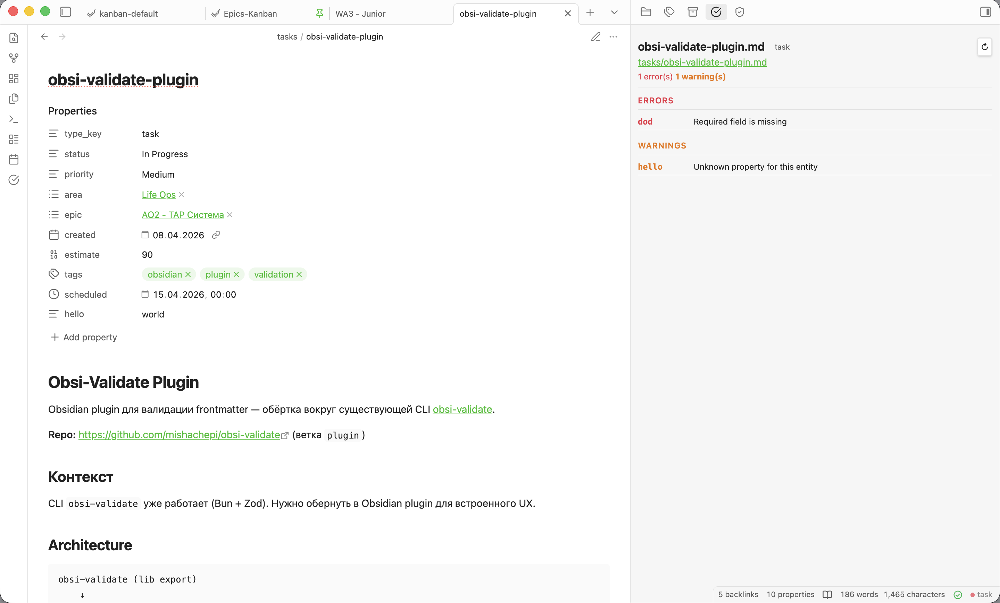

# Obsidian Property Validator

Validate your vault's frontmatter against schemas defined right inside the vault. No external config — your schema lives as YAML frontmatter in special "entity" and "property" files.



This project started as a [CLI hook for Claude Code](cli.md) — a quick check to ensure AI-generated frontmatter only used allowed values. But the problem was bigger than AI: *any* edit could introduce bad data. So the hook grew into a full Obsidian plugin that keeps your vault clean in real time.

## The problem

Obsidian lets you put anything in frontmatter. That's great until your vault grows and you find:

```yaml
# Note A
priority: Medium
# Note B
priority: 10
# Note C
priority: mid
```

Your Dataview queries break. Your templates assume values that don't exist. You spend time hunting down inconsistencies instead of writing.

## How it works

You define two kinds of schema files — regular markdown notes in your vault:

- **Entities** describe note types: "a `task` has fields `status`, `priority`, `project`"
- **Properties** describe field rules: "`status` must be one of `Backlog`, `In Progress`, `Done`"

!!! tip "Think of it like a database"
    An entity is a table definition. A property is a column type. Your notes are rows.

The plugin validates every note's frontmatter against its entity schema and shows results instantly in the status bar and sidebar.

See [Schema reference](schema-reference.md) for the full format.

## Key features

- **Reactive validation** — status bar and results panel update as you edit
- **Entity inheritance** — extend base entities with more specific types
- **Three-level validation** — structure, types, then link constraints and custom JS
- **Link constraints** — ensure linked notes have the right type, folder, or properties
- **Schema management UI** — create and edit schemas from Settings
- **CLI tool** — same validation from the terminal for CI or scripting

## Quick links

- [Getting started](getting-started.md) — install and create your first schema
- [Configuration](configuration.md) — plugin settings and schema management UI
- [Schema reference](schema-reference.md) — entity/property file format and validation logic
- [CLI](cli.md) — command-line usage
- [Architecture](architecture.md) — data flow, modules, security
