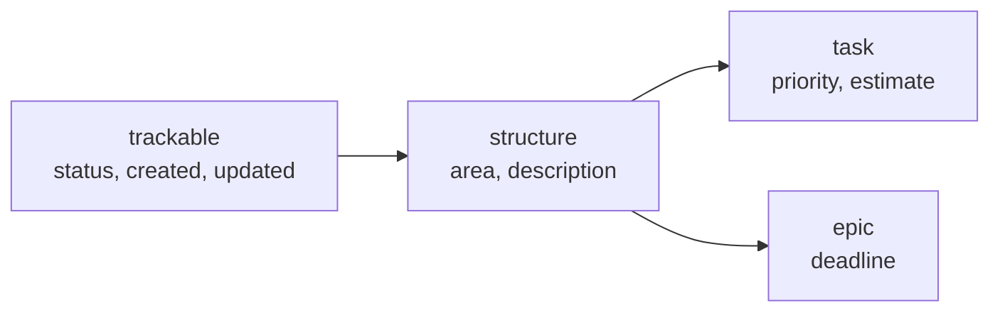
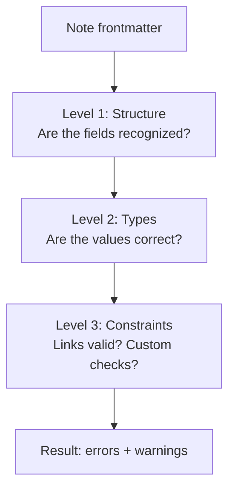

# Schema reference

Schema is defined in two types of files stored in your vault:

- **Entities** describe note types — which frontmatter fields a note should have
- **Properties** describe field rules — how to validate each field's value

!!! tip "Think of it like a database"
    An entity is a table definition. A property is a column type. Your notes are rows.

---

## Directory structure

```
{schema_dir}/
  entities/
    task_entity.md
    structure/           # subdirectories for UI grouping
      area_entity.md
    _deprecated/         # archived, not loaded
  properties/
    status_property.md
    priority_property.md
    _deprecated/
```

---

## Entity files

**Location:** `{schema_dir}/entities/**/*_entity.md`

```yaml
---
entity_name: task
extends: structure
properties:
  priority: { required: true }
  estimate: {}
allow_extra: false
---
```

| Field | Type | Default | Description |
|-------|------|---------|-------------|
| `entity_name` | string | from filename | Entity type identifier |
| `properties` | object | `{}` | Field declarations |
| `extends` | string | — | Parent entity for inheritance |
| `allow_extra` | boolean | `false` | Allow unlisted fields without warning |

!!! note "How are entity files detected?"
    A file is recognized as an entity if it has `entity_name` or `properties` in frontmatter.

### Properties block

```yaml
properties:
  status: { required: true }   # note must have this field
  priority: {}                  # optional field
```

!!! info
    A property listed here doesn't need a corresponding property file — it just won't have type validation. But if a property file with the same name exists, its rules apply automatically.

### Inheritance

Entities can inherit fields from a parent via `extends`:



`task` gets all 7 properties: 2 own + 2 from structure + 3 from trackable. Child properties override parent's config. Circular inheritance is detected and raises an error.

---

## Property files

**Location:** `{schema_dir}/properties/**/*_property.md`

```yaml
---
property_name: status
property_type: enum
allowed_values:
  - Backlog
  - In Progress
  - Done
---
```

| Field | Type | Applies to | Description |
|-------|------|-----------|-------------|
| `property_name` | string | all | Property identifier (fallback: filename) |
| `property_type` | string | all | Validation type (see table below) |
| `allowed_values` | array | enum | Valid values |
| `min_value` | number | number | Minimum |
| `max_value` | number | number | Maximum |
| `unit` | string | number | Unit label (informational) |
| `nullable` | boolean | all | Accept null/empty values (default: `false`). Useful for optional dates, links, etc. |
| `custom_validator` | string | all | JS expression for custom validation |
| `target_type_key` | string/array | link, links, list | Target entity type(s) |
| `target_folder` | string | link, links, list | Target folder prefix |
| `target_has_property` | string | link, links, list | Target must have this field |
| `target_property_value` | object | link, links, list | `{property, value}` match |

!!! note "How are property files detected?"
    A file is recognized as a property if it has `property_name` or `property_type` in frontmatter.

---

## Supported types

| Type | Validates as | Extra constraints |
|------|-------------|-------------------|
| `string` | String | |
| `number` | Number | `min_value`, `max_value` |
| `boolean` | `true` / `false` | |
| `date` | String or Date | |
| `time` | String | |
| `datetime` | String or Date | |
| `enum` | One of `allowed_values` | `allowed_values` required |
| `link` | Single wikilink | link constraints |
| `links` | Array of wikilinks | link constraints |
| `list` | Array of any values | |
| `emoji` | Single emoji character | |

---

## Link constraints

For `link`, `links`, and `list` types — constrain what linked notes must satisfy:

```yaml
---
property_name: owner
property_type: link
target_type_key: person
target_folder: People/
target_has_property: email
---
```

Multiple target types:

```yaml
target_type_key:
  - area
  - project
```

!!! info "How links are resolved"
    `[[Path/Name|Alias]]` becomes `Path/Name`, `[[Note#Heading]]` becomes `Note`. Lookup matches by basename first, then full path.

---

## Custom validators

JS expression that receives `value`. Return `true` to pass, `false` or a string to fail:

```yaml
custom_validator: "value % 0.5 === 0 ? true : 'Must be a multiple of 0.5'"
```

Runs after type validation. Errors in the expression produce a warning, not an error.

!!! warning "Security"
    Custom validators execute JavaScript in the same trust context as your vault. Only use validators from sources you trust. See [Architecture > Security](architecture.md#security).

---

## Validation

### How it works

Property Validator checks notes in three levels:



### Entity type detection

Before validation, the plugin determines the note's entity type:

1. Read the **Entity field** from frontmatter (default: `entity`)
2. If present and is a string — use as entity type
3. If missing — use **Default entity type** (if configured), otherwise skip
4. If not a string (array, object) — error

!!! note
    Schema files (`entity_name` or `property_name` in frontmatter) are always skipped.

### Level 1: Structure

Checks fields against the entity's property list:

- **Known field** — proceed to Level 2
- **Unknown field + `allow_extra: false`** — :yellow_circle: warning
- **Required field missing** — :red_circle: error

### Level 2: Types

Each field with a corresponding property file is checked against the property type:

- No property file — skip (field recognized but no type validation)
- `nullable: true` and value is null/empty — pass
- Otherwise — validate against `property_type`

### Level 3: Constraints

**Custom validators** — JS expression runs with `value`:

| Return value | Result |
|-------------|--------|
| `true` | Pass |
| `false` | Error: "Custom validation failed" |
| A string | Error with that message |
| Throws | Warning (not error) |

**Link constraints** — each link checked against `target_type_key`, `target_folder`, etc.

### Errors vs warnings

| Condition | Result |
|-----------|--------|
| Required field missing | :red_circle: Error |
| Type mismatch | :red_circle: Error |
| Link constraint failed | :red_circle: Error |
| Custom validator failed | :red_circle: Error |
| Unknown field | :yellow_circle: Warning |
| No entity field (skipped) | :yellow_circle: Warning |
| Unknown entity type | :yellow_circle: Warning |
| Custom validator threw | :yellow_circle: Warning |

!!! info
    **Errors** block validation — the note is marked invalid. **Warnings** are informational and don't affect the valid/invalid status.

### Vault scan

**Validate vault** scans all markdown files and produces a summary:

- **Valid** — no errors
- **Invalid** — has errors
- **Skipped** — no entity type


